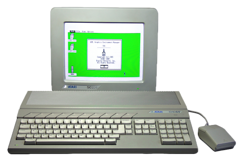

# GEMZ Zig Library for Atari ST development

GEMZ is a Zig library for building Atari ST applications. It wraps GEM
(AES + VDI) and the YM2149 (PSG) in idiomatic Zig types and a small set of
freestanding m68k system-call shims, so you can write a `.PRG` almost entirely
in normal Zig.

It is designed to be a **standalone dependency** — drop it into your own
project's `build.zig`, target `m68k-freestanding-none`, and import `gemz`.

##  LLM Disclosure

The ideas and inspiration behind GEMZ are based on decades of old skool good fun experimentation and hacking.

I have used DeepSeek v4-pro quite a bit in this project for the following:

- Getting the m68k toolchain setup for Zig building, and understanding whats needed.
- As a reference source for looking up GEM APIs, Atari ST memory maps and registers, etc.
- Debugging / tracking down bus errors and illegal instructions.
- Rubber ducking discussions on API shape.
- Generating initial code for functions !!
- Writing consistent documentation, because I suck at writing consistent docs, and dont enjoy that part at all.

---

## Contents

- [Requirements](#requirements)
- [Adding GEMZ to your build](#adding-gemz-to-your-build)
- [A minimal program](#a-minimal-program)
- [GEM: windows and object trees](#gem-windows-and-object-trees)
- [GEM: bitmaps and images](#gem-bitmaps-and-images)
- [GEM: text and colours](#gem-text-and-colours)
- [GEMDOS: files and modal input](#gemdos-files-and-modal-input)
- [Audio: the YM2149 sequencer](#audio-the-ym2149-sequencer)
- [Audio: instruments](#audio-instruments)
- [Audio: note notation](#audio-note-notation)
- [Audio: transposing notes](#audio-transposing-notes)
- [Audio: the equalizer](#audio-the-equalizer)
- [m68k backend: what not to do](#m68k-backend-what-not-to-do)
- [Supervisor mode and absolute addresses](#supervisor-mode-and-absolute-addresses)
- [Example apps](#example-apps)

---

## Requirements

Building an Atari ST `.PRG` needs a Zig that can target m68k plus a couple of
small host tools:

- **Zig with the m68k backend enabled.** The normal upstream Zig does not ship
  m68k support; use the toolchain built by the sibling `zig-m68k/` script. Its
  Zig lives at `~/Atari/bin/zig`.
- **GNU m68k binutils** (`m68k-elf-as`, `m68k-elf-ld`, `m68k-elf-objdump`).
  On macOS: `brew install m68k-elf-binutils`.
- **toslink** — converts a relocatable m68k ELF into a GEMDOS `.PRG`. It is
  built as part of the same toolchain (`~/Atari/bin/toslink`, or
  `libs/toslibc/tool/toslink`).
- **Hatari** (or real hardware) to run the result.

GEMZ itself has **no** runtime dependency on Zig's std library. Everything is
freestanding inline m68k assembly.

---

## Adding GEMZ to your build

GEMZ is a single Zig source file: `src/root.zig`. Expose it as a module and
compile your app against the m68k target.

```zig
// build.zig
const std = @import("std");

pub fn build(b: *std.Build) void {
    // 1. The GEMZ library module.
    const gemz = b.addModule("gemz", .{
        .root_source_file = b.path("src/root.zig"),
    });

    // 2. The m68k target.
    const target = b.resolveTargetQuery(.{
        .cpu_arch = .m68k,
        .os_tag = .freestanding,
        .abi = .none,
    });

    // 3. Your app module, importing gemz.
    const app_mod = b.createModule(.{
        .root_source_file = b.path("src/my_app.zig"),
        .target = target,
        .optimize = .ReleaseSmall,
        .imports = &.{
            .{ .name = "gemz", .module = gemz },
        },
    });

    // 4. Compile to an m68k object, then link to a .PRG (see below).
    const obj = b.addObject(.{
        .name = "MYAPP",
        .root_module = app_mod,
    });
    obj.entry = .{ .symbol_name = "_start" };
    obj.bundle_compiler_rt = false;

    linkToPrg(b, "MYAPP", obj);
}
```

The object-to-PRG pipeline requires some boilerplate to work:

1. Assemble a tiny **startup trampoline** with GNU `m68k-elf-as` (not LLVM's
   assembler) so the branch at text offset 0 is a 68000-safe `bra.w`, not a
   68020-only `bra.l`.
2. Link the trampoline + your object with `m68k-elf-ld --relocatable` using a
   linker script that keeps `_startup` first and discards debug sections.
3. Convert the relocatable ELF to a `.PRG` with `toslink -s`.

```zig
fn linkToPrg(b: *std.Build, comptime name: []const u8, obj: *std.Build.Step.Compile) void {
    const startup = b.addSystemCommand(&.{ "m68k-elf-as", "-o" });
    const startup_o = startup.addOutputFileArg("startup.o");
    startup.addFileArg(b.path("src/startup.s"));

    const elf = b.addSystemCommand(&.{ "m68k-elf-ld", "--relocatable", "--script" });
    elf.addFileArg(b.path("prg.ld"));
    elf.addArg("-o");
    const elf_out = elf.addOutputFileArg(name ++ ".elf");
    elf.addFileArg(startup_o);
    elf.addFileArg(obj.getEmittedBin());
    elf.step.dependOn(&startup.step);

    const toslink = b.addSystemCommand(&.{ "sh", "-c" });
    toslink.addArg("$HOME/Atari/bin/toslink -s -o \"$1\" \"$0\"");
    toslink.addFileArg(elf_out);
    const prg = toslink.addOutputFileArg(name ++ ".PRG");
    toslink.step.dependOn(&elf.step);

    const install = b.addInstallFileWithDir(prg, .{ .custom = "atari" }, name ++ ".PRG");
    b.getInstallStep().dependOn(&install.step);
}
```

`startup.s` is two lines:

```asm
.section .text._startup,"ax",@progbits
    .globl _startup
_startup:
    bra _start
.section .note.GNU-stack,"",@progbits
```

and `prg.ld` just orders `.text`/`.data`/`.bss` and discards `.eh_frame`/`.debug*`.

> If you are copying GEMZ's own `build.zig`, that is the complete pipeline — it
> is self-contained and produces `zig-out/atari/<NAME>.PRG`.

---

## A minimal program

Every app has the same three-part shape:

```zig
const gemz = @import("gemz");

const MyApp = gemz.App(1, 8); // max windows, max objects per window

export fn _start() callconv(.c) noreturn {
    gemz.start();
}

pub fn main() !void {
    var app = try MyApp.init();
    defer app.exit();

    app.form_alert(.default_button, "All your base|are belong to|Zig m68k");
}
```

- `gemz.App(max_views, max_nodes)` instantiates an app type sized for your
  window and object-tree needs. `max_nodes` is the largest object tree you will
  open (root + widgets + images + …).
- `_start` is a 3-line shim. It must live in the **root** module of your app
  (Zig drops `export fn` from imported modules), and it just calls
  `gemz.start()`.
- `main()` calls `MyApp.init()` (which performs `appl_init`), and
  `defer app.exit()` performs `appl_exit`.

`form_alert` builds the GEM alert string for you: `[1][<text>][ OK ]`. `text`
must be a **comptime string literal** — GEMZ concatenates it with `++` at
comptime; runtime string building trips an LLVM m68k byte-store bug.

`form_choice(button, text, buttons)` is the same but with custom buttons and
returns the 1-based button index, e.g. `app.form_choice(.default_button,
"Title|Body", " Play | Close ")`.

---

## GEM: windows and object trees

The high-level API is `App.open()` + `App.run()`:

```zig
fn about(app: *MyApp) bool {          // a click handler
    app.form_alert(.default_button, "GEMZ Hello World");
    return true;                       // keep running
}

fn close(_: *MyApp) bool {
    return false;                      // close the app
}

pub fn main() !void {
    var app = try MyApp.init();
    defer app.exit();

    try app.open(.{
        .kind = .{ .name = true, .closer = true, .mover = true, .sizer = true },
        .title = "GEMZ WINDOW DEMO",
        .x = 50, .y = 50, .w = 320, .h = 200,
    }, &.{
        .box(320, 200),
        .text("A demo written in Zig", 8, 8, 300, 20),
        .button(" About ", 8, 140, 80, 24, .selectable, &.{.{ .click = about }}),
        .button(" Close ", 96, 140, 80, 24, .flags(&.{ .selectable, .exit }), &.{.{ .click = close }}),
    });

    app.run();
}
```

`app.open(spec, nodes)` creates and opens the window, builds the object tree,
and copies it into the app. `app.run()` enters the AES event loop: it redraws on
`WM_REDRAW`, dispatches clicks through the bindings, and returns when the last
window closes.

### Object-tree nodes

The `nodes` slice is built from `Node` constructors, each returning an object
plus its event bindings:

- `.box(w, h)` — a container box (usually the root).
- `.filledBox(w, h, color)` — a solid-colour box (used for backgrounds).
- `.text(s, x, y, w, h)` — a `G_TEXT` label; `s` must be comptime.
- `.textTed(&ted, x, y, w, h)` — a text object with a full `TedInfo`
  (colour, font, justification).
- `.image(&blk, x, y, w, h)` — a 1-bit bitmap image (`G_IMAGE`).
- `.button(s, x, y, w, h, flags, bindings)` — a `G_BUTTON`.

Coordinates are object-tree coordinates, not screen coordinates. The root box
defines the tree's coordinate space; the window's work area maps onto it.

### Event bindings

```zig
pub const Binding = union(EventType) {
    click: *const fn (*Self) bool,
    select: *const fn (*Self, bool) bool,
    edit: *const fn (*Self, i16) bool,
};
```

Handlers take the app pointer and return `bool`: `true` to keep the event loop
running, `false` to stop (e.g. a "Close" button returns `false`). `.flags` lets
you combine object flags, e.g. `.flags(&.{ .selectable, .exit })`.

### Low-level `Window`

For manual control there is also `gemz.Window`:

```zig
const win = try gemz.Window.create(.{ .name = true, .closer = true, .mover = true });
defer { win.close(); win.delete(); }
win.setTitle("...");
win.open(x, y, w, h);
```

with `moveTo`, `workOrigin`, and `workRect` helpers built on `wind_set`/`wind_get`.

---

## GEM: bitmaps and images

1-bit images are built from packed ASCII art at comptime:

```zig
const FUJI = gemz.bitmap(&.{
    "..................##..####..##..................",
    "..................##..####..##..................",
    "..................##..####..##..................",
    "..................##..####..##..................",
    ".................###..####..###.................",
    ".................###..####..###.................",
    ".................###..####..###.................",
    ".................###..####..###.................",
    ".................###..####..###.................",
    "................####..####..####................",
    "................####..####..####................",
    "................####.######.####................",
    "...............####..######..####...............",
    "..............#####..######..#####..............",
    "..............#####..######..#####..............",
    "............######...######...######............",
    "...........######....######....######...........",
    "..........######.....######.....######..........",
    "........#######......######......#######........",
    ".....#########.......######.......#########.....",
    ".###########.........######.........###########.",
    "##########...........######...........##########",
    "#######..............######..............#######",
    "###..................######..................###",
});

const LOGO = gemz.BitBlk.from(&FUJI, .black);
```

- `gemz.bitmap(rows)` packs ASCII art (`#` = set, anything else = clear) into a
  `Bitmap` at comptime.
- `gemz.BitBlk.from(&bitmap, color)` wraps it in the GEM `BITBLK` a `G_IMAGE`
  expects.
- Put it in the tree with `.image(&LOGO, x, y, w, h)`.

The `Bitmap`/`BitBlk`/`TedInfo` must be **module-level `const`s** so their
addresses are stable; the object tree stores pointers, not copies.

---

## GEM: text and colours

`Gemz.Color` maps to the low 16-colour palette:

```zig
.white, .black, .red, .green, .blue, .cyan, .yellow, .magenta
```

For coloured text, make a module-level `TedInfo`:

```zig
const RED = gemz.TedInfo.from("  .. GEMZ library v0.1.0", .magenta);
```

and reference it with `.textTed(&RED, ...)`. `TedInfo.from` fills the common
fields (font, justification, colour) with sane defaults.

---

## GEMDOS: files and modal input

GEMZ exposes GEMDOS file calls (`trap #1`) as Zig error unions. Failures
return a `gemz.GemdosError` (`error.FileNotFound`, `error.InvalidHandle`, …)
instead of a negative handle/count:

```zig
const h = try gemz.openFile("TODO.db", .read);
defer gemz.close(h) catch {};

var buf: [256]u8 = undefined;
const n = try gemz.read(h, &buf, 256); // bytes read; 0 = EOF

const w = try gemz.createFile("TODO.db"); // create / truncate
try gemz.writeAll(w, "...", 3);
try gemz.close(w);

// seek returns the new absolute position:
const size = try gemz.seek(h, .end, 0);
```

- `openFile(name, mode)` / `createFile(name)` return a handle (`i16`).
- `mode` is `gemz.OpenMode`: `.read`, `.write`, `.read_write`.
- `read` / `write` return the byte count (`u32`); `writeAll` loops until done.
- `seek(handle, mode, offset)` returns the new position; `mode` is
  `gemz.SeekMode`: `.start`, `.current`, `.end`.

For a single line of user input, `gemz.formInput` builds a tiny `form_do`
dialog with a `G_FTEXT` field — no keyboard scancode handling in your app:

```zig
var input: [40]u8 = undefined;
input[0] = 0;
if (gemz.formInput("New task:", &input, input.len)) {
    // input now holds the NUL-terminated answer
}
```

---

## Audio: the YM2149 sequencer

GEMZ includes a three-voice step sequencer for the Atari ST's YM2149 (PSG).

```zig
// Define instrument 1 once at startup: a punchy downward-sawtooth pluck.
app.setInstrument(1, 0x00, 6, .decay);

// One-shot melody on channel A (defaults: volume 15, loop false).
app.play(.A, "e1 e2 g1 e2", .{ .bpm = 120, .instrument = 1 });

// Looping melody on channel A.
app.play(.A, "d2- d1- f1- d1-", .{ .bpm = 100, .instrument = 1, .loop = true });

// A full multi-channel arrangement with per-part rep scheduling. Instrument 0
// is reserved for "no envelope" (plain fixed-volume tone / drums).
const song = [_]gemz.Part{
    .{ .channel = .A, .notes = "e1 b0 d2 b0", .volume = 15, .from_rep = 1, .to_rep = 4, .instrument = 1 },
    .{ .channel = .B, .notes = "k . . . k . . . k . . . k . . .", .volume = 15, .from_rep = 3, .to_rep = 12 },
};
app.playSong(song, 80);

app.stopMusic();
```

- `Channel` is `enum(u8) { A = 0, B = 1, C = 2 }`.
- `play(channel, notes, opts)` — `opts` is a `PlayOptions` struct:
  `{ bpm = 80, volume = 15, instrument = 0, loop = false }`.
- `setInstrument(id, fine, coarse, shape)` — `shape` is an `EnvelopeShape`:
  `.decay`, `.decay_repeat`, `.attack`, `.attack_repeat`, `.triangle_down`,
  `.triangle_down_once`, `.triangle_up`, `.triangle_up_once`. Instrument 0 is
  reserved and means "no envelope".
- `Part` is `{ channel, notes, volume, from_rep, to_rep, instrument }`.
  `from_rep`/`to_rep` are 1-based repetition numbers; a part plays from
  `from_rep` through `to_rep` inclusive (`to_rep = 0` means "until the song
  ends"). `instrument` selects a `setInstrument` slot (0 = no envelope).
- `playSong` treats **channel A as the master clock**: each time A's 16-step
  loop wraps, the rep counter advances and the scheduler arms/stops the parts
  whose `from_rep`/`to_rep` match.

The sequencer does not trust the AES timer for tempo; it reads the system clock
and steps tracks by elapsed ticks.

---

## Audio: instruments

GEMZ has **16 named instrument slots**. Slot **0** is reserved and means "no
instrument" — a plain fixed-volume tone with no hardware envelope. Every
`play`/`Part` references an instrument slot.

There are two kinds of instrument:

```zig
// Tone instruments (slots 1-11): the YM2149 hardware envelope.
app.setInstrument(id, fine, coarse, shape);

// Percussion instruments (slots 12-16): a software voice.
app.setPercussion(id, burst, noise, tone_start, tone_end);
```

### Tone instruments (`setInstrument`)

A tone instrument maps to the YM2149's hardware envelope. It has three
parameters:

- **`fine`** — low byte of the 16-bit envelope period (`R11`).
- **`coarse`** — high byte of the 16-bit envelope period (`R12`).
- **`shape`** — an `EnvelopeShape` (`R13`).

`fine` and `coarse` are not two independent things; together they form one
16-bit period:

```
period = coarse * 256 + fine
```

On the Atari ST's 2 MHz PSG clock the resulting envelope time is roughly:

```
time ≈ period * 128 µs   =   (coarse * 256 + fine) * 128 µs
```

So **smaller = faster/snappier**, **larger = slower/longer**. For example
`coarse = 2` is ~66 ms and `coarse = 6` is ~197 ms. Usually you move `coarse`
for the main feel and leave `fine` at 0 for fine-trim only.

`shape` selects the envelope waveform (`EnvelopeShape`):

- `.decay` — single downward decay (the classic pluck).
- `.decay_repeat` — downward saw, repeating.
- `.attack` — single upward attack.
- `.attack_repeat` — upward saw, repeating.
- `.triangle_down` / `.triangle_down_once` — triangle, repeating / one-shot.
- `.triangle_up` / `.triangle_up_once` — inverted triangle, repeating / one-shot.

Because GEMZ re-triggers the envelope on every tone note, one-shot shapes give
a fresh pluck per step; repeating shapes keep cycling until the software gate
silences the channel.

```zig
app.setInstrument(1, 0x00, 6, .decay); // ~197 ms pluck
```

### Percussion instruments (`setPercussion`)

Slots **12–16** are reserved for percussion and are pre-seeded with editable
defaults (see the `kick_*`, `snare_*`, `hat_*`, `tom_*`, `spare_*` constants at
the top of `src/root.zig`):

- **12** = kick
- **13** = snare
- **14** = hi-hat
- **15** = tom-tom
- **16** = spare

Percussion does **not** use the hardware envelope — the chip only has one such
envelope and the bassline already owns it. Instead GEMZ synthesises each hit in
software:

- **`burst`** — hit length in sequencer ticks (~15 ms each).
- **`noise`** — noise pitch (`R6`, 0–31; lower = brighter, higher = duller).
- **`tone_start` / `tone_end`** — for pitched percussion, the tone period is
  swept from `tone_start` down to `tone_end` across the burst (this is what
  makes a kick "drop"). `0` for both means noise-only.

```zig
app.setPercussion(12, 16, 6, 0x0200, 0x0E00); // longer, deeper kick
```

### Experimenting

The fastest loop is: edit the constants at the top of `src/root.zig` (or call
`setInstrument` / `setPercussion` at startup), rebuild, and listen. `DAF.PRG`
uses instrument 1 for its basslines and the 12/13/14 percussion defaults for
kick/snare/hat, so it's the natural place to audition changes.

---

## Audio: note notation

Notes are a compact string. Tokens are separated by spaces and/or commas.

- `a`–`g` — note letter.
- optional `b` after the letter — flat (`bb` = B-flat).
- `0`–`3` — octave (octave `0` = scientific octave 1).
- `.` — rest.
- `k` / `s` / `h` — kick / snare / hat (percussion hits).
- trailing `-` — doubles the duration (`d2-` = 2 steps, `d2--` = 4 steps).

Examples:

```
"e1 b0 d2 b0, b1 b0 b0 b1, b0 b1 b0 b1, a1 b0 b1 b0"
"k . . . k . . . k . . . k . . ."
"h h h h s h h h h h h h s h h h"
```

There are at most `gemz.max_notes` (64) steps per track.

---

## Audio: transposing notes

Two comptime helpers rewrite note strings:

```zig
// Whole octaves.
gemz.pitchShift("e1 b0 d2 b0", 1)  // -> "e2 b1 d3 b1"

// Semitones (positive = up, negative = down).
gemz.transpose("e1 b0 d2 b0", -4)   // -> "c1 g0 bb1 g0"  (down a major third)
```

Both are **comptime** and return a `[]const u8`, so they can be used inline in a
`Part`:

```zig
.{ .channel = .A, .notes = gemz.transpose(bassline, -4), .volume = 15, .from_rep = 5, .to_rep = 6 },
```

`pitchShift` only adjusts octave digits (and clamps to 0–3). `transpose`
rewrites note names across the full chromatic scale (spelled with flats:
`c db d eb e f gb g ab a bb b`) and clamps the octave.

Because they run at comptime on the host compiler, they are immune to the m68k
codegen issues described below.

---

## Audio: the equalizer

GEMZ ships a small scrolling 1-bit line graph intended to be dropped into an
object tree as a `G_IMAGE`:

```zig
.image(gemz.eqBitBlk(), 44, 110, 232, 12),
```

The bitmap is `gemz.eq_w × gemz.eq_h` (232×12). When wired up, it is driven by
the sequencer while music is playing; the newest column is sized from channel
A's current note (taller = higher pitch), and it drops to 0 during gate/silence.

> **Status:** the equalizer helpers exist in the library, but the `DAF.PRG`
> wiring is currently commented out. The first attempt redrew the whole object
> tree every music tick, which made playback unusably slow. Restoring it needs a
> clipped `objc_change`/`wind_update` repaint of just the `G_IMAGE` node, not a
> full-tree redraw.

---

## m68k backend: what not to do

The m68k codegen this toolchain uses (LLVM's experimental m68k backend) is
fragile. These are the failure modes that have actually bitten this project.

1. **Do not iterate an array with `for (&arr, 0..) |*elem, i|`.**
   The backend can drop the running element pointer and touch element 0 on every
   iteration. Unroll instead with a comptime index, or pass a stable pointer to
   a leaf function:

   ```zig
   // NOT this:
   // for (&self.music, 0..) |*t, ch| { ... t.active ... }

   // This:
   var done = self.stepTrack(0, elapsed);
   done = self.stepTrack(1, elapsed) or done;
   done = self.stepTrack(2, elapsed) or done;

   fn stepTrack(self: *Self, comptime ch: usize, elapsed: u16) bool { ... }
   ```

2. **Do not do runtime string/byte parsing with a `while` loop plus
   `continue` and indexed stores.** The original note parser ran away past its
   buffer. If the input is comptime-known (note strings always are), force
   comptime evaluation: `t.* = comptime parseNotes(notes);`.

3. **Do not write `if (x >= y)` where the two arms are load-bearing.** The
   backend has swapped the then/else branches of `>=`. Invert to
   `if (x < y) { ... } else { ... }` and verify.

4. **Do not do runtime indexed byte stores (`arr[i] = u8`).** The index register
   can be dropped. Prefer pointer arithmetic (advance a `[*]u8`), a scalar
   accumulator written once, or a comptime index.

5. **`u32 * u32` used to be unavailable** — with `-fno-compiler-rt` there was
   no `__mulsi3`, so 32-bit multiplies failed to link. GEMZ now provides a
   68000-safe `__mulsi3` shim, so they link and run; they compile to a slow
   shift-and-add call, so still prefer shifts for hot doubling/halving paths.

6. **Do not combine comptime recursion with `inline for` over an array of
   structs when the body does struct-field stores.** It has compiled to dead
   code. Keep comptime recursion simple, or unroll manually, and disassemble to
   confirm the code exists.

7. **Prefer struct-field stores through `self`** and avoid mutable `var`
   globals for program state.

8. **Do not write bytes into a mutable global buffer** (even via a struct field
   or a runtime-loaded pointer). The backend constant-folds the address back to
   the global and emits the illegal `move.b Dn,(d16,PC)` — PC-relative
   addressing is not a legal store destination. Immediate stores hit it too
   (`0x31FC → 0x35FC` crashed the counter's `count = 0` at startup). Write the
   bytes through `gemz.storeByte` / `gemz.storeWord` and confirm the PRG's
   **text section** contains no `move.{b,w,l} …,(d16,PC)` opcodes
   (`0x15/25/35` `c0-ff` family) — see `M68K_NOTES.md` for the exact grep.

9. **Do not compare a mutable global directly** (`if (count == 0)`). The backend
   can lower it to `cmpi.w #0,(d16,PC)` — an illegal instruction, because CMPI
   has no PC-relative form. Load the global into a register first, e.g. via a
   `noinline` getter, and compare the register.

The rule of thumb: **don't carry a runtime pointer/offset around a loop; prefer
comptime-fixed addresses.** After any change that touches these shapes,
disassemble the `.PRG` and confirm the generated code actually does what the
source says:

```sh
m68k-elf-objdump -b binary -m m68k --adjust-vma=0 -D zig-out/atari/MYAPP.PRG
```

PC-relative branches (`beq`, `bne`, `bccs`, …) are final; relocatable
`jsr`/`lea` targets in that dump are pre-relocation placeholders.

---

## Supervisor mode and absolute addresses

Do not assume an absolute memory address is readable from user mode.

Atari ST system state (the 200 Hz counter `_hz_200` at `$4BA`, system variables,
and other low-memory/TOS structures) lives outside a normal process's user
address space. A direct read of `$4BA` from user mode **bus-errors** in this
Hatari + EmuTOS setup, and the obvious supervisor-mode workarounds (`Supexec`)
also faulted here.

The correct approach is to go through the documented OS trap calls instead:

- `_hz_200` → use **XBIOS Gettime** (`trap #14`, opcode 23), or another
  documented XBIOS/GEMDOS call, rather than reading `$4BA`.
- GEM functions → AES `trap #2` / VDI `trap #2` through the GEMZ wrappers.
- GEMDOS file/console I/O → `trap #1`.

GEMZ already routes its clock and all its GEM calls through traps; if you add
your own low-level code, do the same. When a trap needs arguments, remember
GEMDOS/XBIOS arguments are pushed **right-to-left** (the last C argument ends up
on top of the stack at trap time), and the caller pops them afterwards.

---

## Example apps

The examples are small, self-contained `.zig` files under `src/`. Each is built
by `build.zig` into a `.PRG`.

### `welcome.zig` → `HELLO.PRG`

**PRG size:** 1051 bytes

The minimal possible app: `_start` shim + `MyApp.init()` +
`form_alert(...)`.

Worth noting:

- `gemz.App(1, 8)` sizes the app for 1 window and 8 objects.
- `defer app.exit()` ensures `appl_exit` runs.
- The alert text is a comptime string literal (see the m68k notes).

### `window.zig` → `WINDOW.PRG`

**PRG size:** 6926 bytes

A full window demo: object tree, static `TedInfo`, a comptime bitmap logo, and
button click bindings.

Worth noting:

- `RED = gemz.TedInfo.from(...)` is a **module-level const** — object trees store
  pointers, so their targets must have stable addresses.
- `gemz.bitmap(...)` + `gemz.BitBlk.from(...)` build the Fuji logo at comptime.
- `.button(...)` carries a `click` binding; handlers return `bool` to keep
  running or quit.
- `.flags(&.{ .selectable, .exit })` marks the Close button as the exit
  widget.

### `daf.zig` → `DAF.PRG`

**PRG size:** 14590 bytes

The big one: a multi-track music sequencer demo (the "Der Mussolini" and
"Sato Sato" arrangements) with the named-instrument system.

Worth noting:

- `app.setInstrument(1, 0x00, 6, .decay)` defines instrument 1 once at boot;
  each `Part` and `play` call then references it by number.
- `gemz.transpose(...)` is used inline to generate the mid-song pitch-shifted
  bassline from the same source string.
- `gemz.Part`'s `from_rep`/`to_rep` drive the arrangement across repetitions;
  channel A is the master clock.
- The equalizer node (`gemz.eqBitBlk()`) is present in the source but currently
  commented out — the naive per-tick full-tree redraw made playback too slow.
- `form_choice` presents "Play | Close" and returns the pressed button.

### `timer_test.zig` → `TIMER.PRG`

**PRG size:** 509 bytes

A standalone diagnostic that cross-checks the system clock against the VBL and
writes a result file. It deliberately does **not** use the GEMZ abstractions
for I/O — it's a worked example of raw GEMDOS/XBIOS calls.

Worth noting:

- Direct `move.w 0x4ba, ...` — included to demonstrate the supervisor-mode
  hazard; this is exactly the access that bus-errors in the main app and why
  GEMZ uses the XBIOS Gettime trap instead.
- Hand-rolled `Fcreate`/`Fwrite`/`Fclose` GEMDOS bindings with right-to-left
  argument pushes.
- The hex formatting writes through a `[*]u8` pointer (`p[0] = ...; p += 1`),
  never an indexed byte store — a direct illustration of the m68k workaround.

### `counter.zig` → `COUNTER.PRG`

**PRG size:** 7062 bytes

A minimal stateful app: a `u16` counter with `+ Increment`, `- Decrement` and
`Reset` buttons and a live number readout.

Worth noting:

- The number is displayed through a `gemz.TedInfo` pointing at a module-level
  text buffer, because GEM object trees store pointers that must remain valid.
- Updating that **global** buffer is exactly the case the m68k backend breaks:
  a plain `buf.c0 = ...` lowers to an illegal PC-relative store. The fix is
  `gemz.storeByte`, an inline-asm byte store through an address register.
- `app.redrawNode(1)` repaints only the changed number widget after each state
  change, avoiding the full-window flash.

### `todo.zig` → `TODO.PRG`

**PRG size:** 14183 bytes

A small GEM todo list: add/toggle/delete tasks, move a selection cursor, and
persist to `TODO.db` (one line per task; the first character is `D` done or
`T` todo). The window is 380×320 with a title bar, closer, mover and sizer; it
shows 9 task rows, a coloured header, and a live status footer.

Worth noting:

- All mutable global state (`items`, the visible line buffers, the status line)
  is written through `gemz.storeByte` / `gemz.storeWord` — never a plain
  indexed store.
- Runtime indexing walks pointers with `p += 1`; LLVM may strength-reduce these
  back into multiplies, which is fine now that GEMZ provides `__mulsi3`.
- `gemz.formInput` supplies the "New task" prompt (a `form_do` dialog with an
  editable `G_FTEXT` field).
- `gemz.openFile` / `read` / `createFile` / `writeAll` / `close` load and save
  the database (error-union wrappers around the raw GEMDOS traps).
- `TODO.db` is a **relative** path, so it lands in GEMDOS's current directory
  when the app is launched (typically `C:\GEMZ` or `C:\` depending on how you
  start it).
- Line colours are changed at render time via `gemz.storeWord` into each
  `TedInfo.color`, so done = green, selected = red, todo = black.

### `space.zig` → `SPACE.PRG`

**PRG size:** 691 bytes

Fullscreen graphics smoke test: bypasses GEM entirely, saves the desktop
screen, switches to low resolution (320×200, 16 colours), flashes the
framebuffer for a few seconds, then restores the desktop and exits.

Worth noting:

- `screen.setScreen(...)` / `screen.vsync()` / `screen.physbase()` / `logbase()`
  are thin XBIOS (`trap #14`) shims in `screen.zig`.
- `screen.fillScreen` writes the ST's interleaved bitplane layout with a
  `[*]u8` pointer walk.
- The framebuffer is **over-allocated and 256-byte aligned at runtime** — the
  ST Shifter requires a 256-byte-aligned screen base, but the bare linker only
  guarantees 4-byte alignment.

---

## More detail

For the full, continuously-updated list of m68k backend landmines and the
verification workflow, see `M68K_NOTES.md` at the repository root.

---


## Observations on using DeepSeek for retro development

Ill state up front that I really dont like the whole AI thing - I dont like the hype, I dont like the brain rot, and I definitely dont like the social and environmental impact.

That Everything-AI skepticism is a good part of the reason why hacking on retro machines is appealing in the first place.

But, I have used a lot of DeepSeek here anyway, because as a tool for a specific purpose, its technically useful.

Its a bit of a political hot potato talking about this LLM stuff. My 2c opinion here is that if you must use it, then at least be honest about it, and try and be a good ambassador 
for your workflow choices, if you think they are genuinely useful for some things.

Current LLMs are probably nowhere near as bad as they used to be (dont really know), but you still have to babysit it sometimes. Its still time consuming work, with or without LLM help.

Thoughts on code generation - its not too bad, as long as you keep the scope really really narrow, and be prepared to rewrite / restructure the output to apply 'good taste' before you
call it done. Its hard to say, sometimes its pretty good, sometimes not so much. I wouldn't recommend you "dont read the code" it outputs anyway.

For debugging though - oh ... there is no way i would be stepping through disassm and machine opcodes with both the compiled PRG, the data segment, and the ROM all the way
to the bone the way that DeepSeek has been able to do here. Considering for retro machines, holding the entire machine state in LLM context appears to be feasible. 

Especially on a machine like an Atari ST, where the smallest crime against the hardware locks the whole thing up, or throws a bus error, making it quite a chore to debug, because
the machine can get into a state where you need to hit that reset button.

Its also been able to compare Zig IR output to LLVM generated machine code and find & prove a number of persistent miscompilations. Thats hard and tedious to do manually.

Not saying the LLM is even right half the time ... but man, it really munches through machine code for breakfast. Actually impressive for this use case. 

Of course - YMMV, so you do you.
